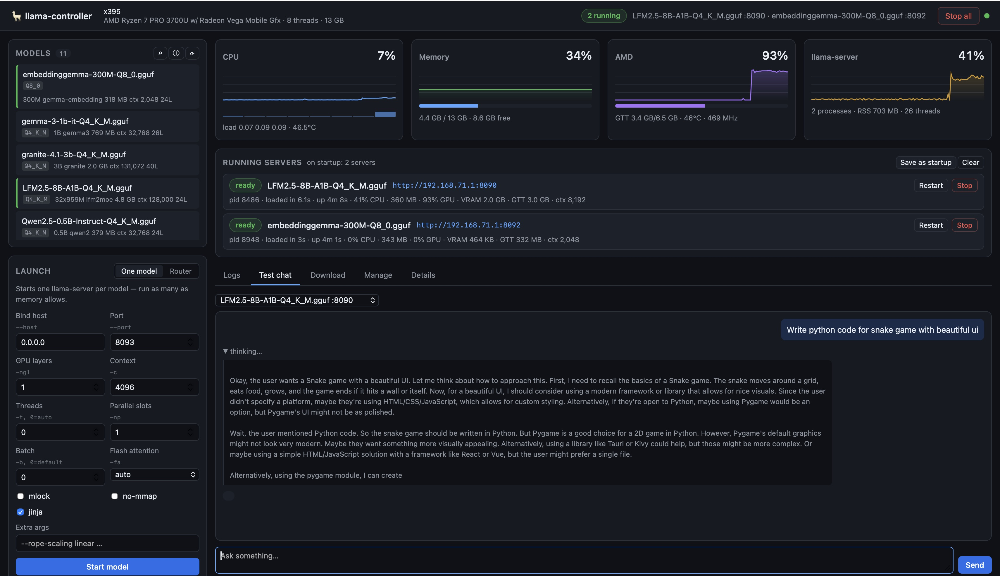
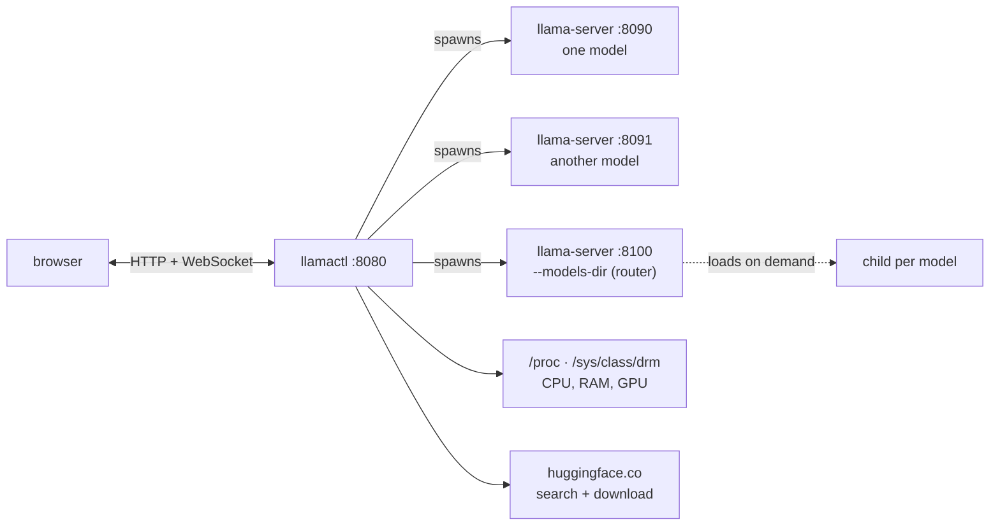
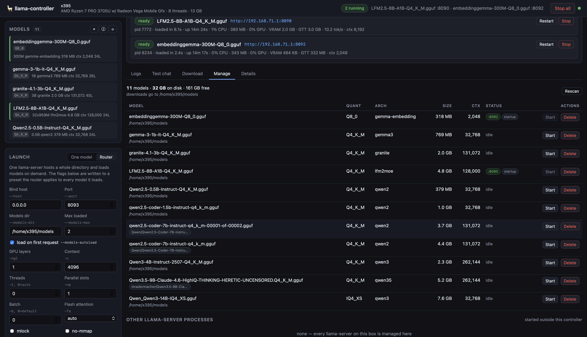
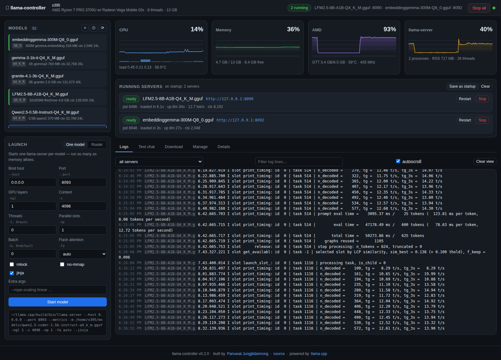
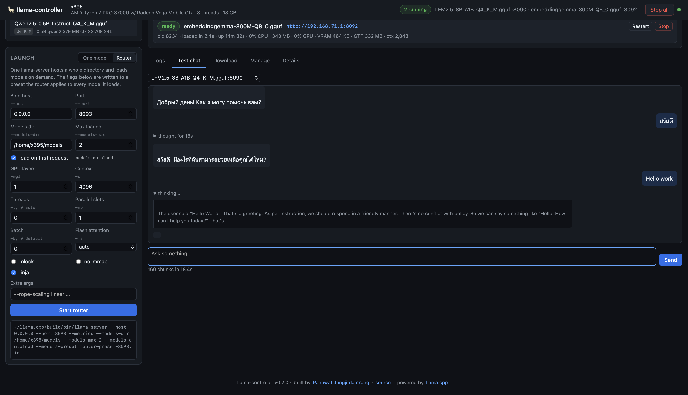

<div align="center">

# llama.cpp controller

**Run llama.cpp from a web page instead of a terminal.**

Pick a GGUF, start it with the flags you want, run several models side by side,
pull new ones from Hugging Face, and watch CPU, memory and per-model GPU usage
while they work.




<sub>Two models running. The graphs update once a second, and each server reports its own share of the GPU — here one model holds 93% of it while the other sits idle.</sub>

</div>

Four Python dependencies, no build step, no database, no JavaScript framework.
The dashboard is plain HTML/CSS/JS served by the same process that supervises
the models.



## Why

llama.cpp gives you an excellent server. What it does not give you is a
comfortable way to *operate* it.

Starting a model means recalling a long command line. Changing a flag means
finding the process, killing it, and typing the line again. Running a second
model means a second terminal, a second port to remember, and no easy way to see
which one is eating the machine. Trying a model you do not have yet means leaving
for a browser, finding the right quantisation, downloading it, and coming back.

I wanted that to be a web page: choose a model, press start, see what is running
and what it costs. Everything here follows from that — and the guardrails that
grew along the way are the bugs it caught, written down so they cannot happen
twice.

## Highlights

| | |
| --- | --- |
| **Many models, one panel** | A `llama-server` per model, ports allocated automatically, each with its own state, endpoint, throughput and controls |
| **Router mode** | Or let one server host a whole directory and load on demand — with the flags actually passed through, which llama.cpp's own router does not do for you, per model as well as shared |
| **Per-model GPU** | Not just the card total: VRAM, GTT and GPU share attributed to each model, from DRM fdinfo or `nvidia-smi` |
| **Memory guard** | Starts are refused when weights plus KV cache will not fit, counting what is already promised — not what happens to be free |
| **Tuned by measurement** | *Tune* sweeps GPU offload and thread count for one model, then saves the winner as its settings |
| **Hugging Face built in** | Search, browse quantisations by size, download with resumable progress, appear in the model list |
| **Survives a reboot** | Save the running set, install the systemd unit, and the box comes back serving models with nobody logged in |

## What it does

**Run several models at once.** Each model gets its own `llama-server` process on
its own port. Ask for a port that is taken and the next free one is used. Every
server is listed with its state, endpoint URL, CPU, memory, GPU share and
tokens/second, and can be stopped or restarted independently.

**Router mode.** The alternative: one `llama-server` started with `--models-dir`
hosts a whole directory on a single port and loads models on demand, up to
`--models-max` at a time. The panel lists what the router knows about, shows
which models are resident, and can load or unload them explicitly.

**Memory guard.** A start is refused when the model will not fit — the estimate
covers weights plus KV cache, and counts what is already promised to running
instances rather than what happens to be free this instant. The systemd unit
also caps the models at a share of RAM so an override is contained in the cgroup
instead of taking the machine down.

**Per-model GPU usage.** Not just the card total: how much VRAM and GTT *this*
model holds, and what share of the GPU *this* model is using, read from DRM
fdinfo (AMD/Intel) or `nvidia-smi`.

**Model management.** Every discovered GGUF in one table with quantisation,
architecture, size, training context, running/startup state and disk headroom.
Start or delete from there; deletion refuses anything outside the configured
directories or currently being served.

<div align="center">



<sub>Every GGUF the controller can see, with what is running, what starts on boot, and how much disk is left.</sub>

</div>

**Download from Hugging Face.** Search the Hub (or paste an `org/repo`), see
every GGUF file with its size, download with a live progress bar. Interrupted
transfers resume with a Range request. No token, no `huggingface_hub` dependency.

**Startup set.** *Save as startup* records exactly what is running now; the
controller brings the same set back next time it starts, one at a time, waiting
for each to load. With the systemd unit, the box comes back from a reboot
serving models with nobody logged in.

**Finds each model's settings by measuring.** *Tune* on a model starts it once
per candidate configuration, asks the same question, and times prompt processing
and generation separately. The winning configuration can be saved as that model's
settings with one press, which then apply both when it is started on its own and
when a router loads it. On an integrated GPU the answer is often not the obvious
one — a 0.5B model here generates at 53 tok/s on the CPU against 42 on the GPU,
while the GPU reads prompts six times faster.

**Access control when you want it.** Off by default; one switch in Settings mints
a token that the dashboard, the API and any OpenAI-compatible client can use as
`Authorization: Bearer …`. Requests from the machine itself can be exempted (turn
that off behind a reverse proxy). If the token is ever lost it is still in
`config.json`, and `python -m llamactl --no-auth` starts without it.

**Settings in the panel.** Binary path, model directories, defaults for new
models and retention are editable in a Settings tab instead of by hand in
`config.json`.

**Explains itself.** Every launch flag carries a plain-language note under the
field — what it does, and the part that surprises people. `-np` divides the
context rather than multiplying it; `-ngl 99` is worth testing against `0` on an
integrated GPU, where a very small model can generate faster on the CPU. The `?`
button in the Launch panel hides the notes once you know them.

**Live logs and a test chat.** Every server's output streamed over one websocket,
tagged with the model it came from, filterable by server and text. Tokens/second
are parsed from the timing lines. A minimal streaming chat box confirms a model
actually answers.

<div align="center">



<sub>Every server's output in one stream, tagged by model, with tokens/second parsed out of llama.cpp's timing lines.</sub>



<sub>Left: router launch parameters. Right: a reasoning model answering in Thai, with its thinking collapsed behind “thought for 18s”.</sub>

</div>

## Hardware support

| | Read from | What you get |
| --- | --- | --- |
| AMD (`amdgpu`) | `/sys/class/drm` + `fdinfo` | busy %, VRAM, GTT, temperature, clock, **per-process** |
| Intel (`i915`/`xe`) | same | memory and clock; busy % is not exposed by the driver |
| NVIDIA | `nvidia-smi` | busy %, VRAM, temperature, power, clock, per-process VRAM |
| No GPU | — | the card reads "no supported GPU detected" |

Several GPUs, and several vendors at once, each get their own card. CPU and
memory come from `/proc` on Linux; elsewhere the controller falls back to
`psutil` when it is installed.

## Install

On the machine that hosts llama.cpp:

```bash
git clone git@github.com:p-jungjitdamrong/llama.cpp-controller.git
```

```bash
python3 -m venv ~/llama_controller_venv && ~/llama_controller_venv/bin/pip install -r requirements.txt
```

On Debian/Ubuntu `python3 -m venv` may first need `sudo apt install python3-venv`
(or the versioned package, e.g. `python3.14-venv`).

## Run

As a service, which is what you want on a box that should come back after a
reboot:

```bash
sudo ./scripts/install-service.sh
```

It fills the unit template in `systemd/` with the current user, paths and venv,
installs it to `/etc/systemd/system/`, then enables and restarts it. The service
runs unprivileged as the user who owns the checkout — sudo only writes the unit
file. `PORT=`, `HOST=`, `LLAMA_PORT=` and `PYTHON=` override the defaults.

```bash
sudo systemctl restart llama-controller && journalctl -u llama-controller -f
```

Every llama-server it starts lives in the service's cgroup, so `systemctl stop`
takes the models down with it and leaves nothing orphaned.

Without systemd, or while developing:

```bash
./scripts/ctl.sh start
```

Then open `http://<host>:8080`.

## Choosing a model for your hardware

`scripts/bench-models.py` starts each model through the controller and measures
what actually matters, including whether its chat template supports tools and how
much of the prompt the KV cache reuses on the next turn:

```bash
python3 scripts/bench-models.py --ctx 4096 --max-size-gb 6
```

Measured on a ThinkPad X395 — Ryzen 7 PRO 3700U, Radeon Vega 10, 13 GB RAM,
Vulkan backend:

| model | size | gen tok/s | tool calls | 2-step loop |
| --- | ---: | ---: | :---: | ---: |
| Qwen2.5-0.5B-Instruct | 0.37 GB | 45.1 | ✓ | 1.6 s |
| **LFM2.5-8B-A1B** | 4.8 GB | **23.9** | ✓ | 10.2 s |
| granite-4.1-3b | 1.96 GB | 13.9 | ✓ | 7.1 s |
| Qwen3-4B-Instruct-2507 | 2.33 GB | 11.9 | ✓ | 11.4 s |
| qwen2.5-coder-7b-instruct | 4.36 GB | 7.3 | ✗ | — |
| Qwen3-14B | 7.55 GB | 3.7 | ✓ | — |

Two results worth keeping: a **mixture-of-experts model beat a smaller dense one
by 3.3×** (LFM2.5-8B-A1B activates ~1B parameters per token, so on a
bandwidth-bound machine it runs far faster than a dense 7B), and the **Qwen2.5
coder models cannot emit tool calls at all** — their chat template has no tool
support, which makes them a poor agent brain and an excellent fill-in-the-middle
completion engine, which is what they were built for.

## Configuration

`config.json` is written next to the package on first run and updated whenever
you start a model.

| Key | Meaning |
| --- | --- |
| `llama_server_bin` | path to the `llama-server` binary |
| `model_dirs` | directories scanned for `.gguf` (5 levels deep, hidden dirs skipped) |
| `controller_host` / `controller_port` | where the dashboard binds |
| `defaults` | launch flags for a model with no saved preset, including `host` and `port` |
| `presets` | per-model launch flags, saved automatically on start |
| `autostart` | servers to bring up on startup, written by *Save as startup* |

## API

| Method | Path | Purpose |
| --- | --- | --- |
| GET | `/api/info` | host details, config, foreign llama-server processes |
| GET | `/api/models` | discovered GGUF files with metadata, disk usage, and what was skipped |
| POST | `/api/models/delete` | `{path, confirm}` — only inside the model dirs, never a model in use |
| GET | `/api/status` | every instance: state, argv, endpoint, throughput |
| POST | `/api/server/start` | `{model_path, params}`; `params.mode: "router"` starts a router |
| POST | `/api/server/stop` · `restart` · `remove` | `{id}` |
| POST | `/api/server/clear-port` | kill a llama-server orphaned by an earlier run |
| POST | `/api/router/load` · `unload` · `refresh` | `{id, model}` |
| GET · POST | `/api/autostart` | read the startup set; POST `{}` saves what is running |
| GET | `/api/hub/search?q=` · `/api/hub/files?repo=` | browse Hugging Face |
| POST | `/api/hub/download` · `cancel` | `{repo, path}` / `{id}` |
| GET | `/api/processes` · POST `/api/processes/kill` | foreign llama-server processes |
| GET | `/api/logs?limit=&instance=` | recent log lines |
| WS | `/ws` | 1 Hz metrics, server states, downloads; log lines as they arrive |
| POST | `/api/chat` | streaming passthrough; `{instance, model?, messages}` |
| ANY | `/proxy/{id}/{path}` | passthrough to one server (`/slots`, `/metrics`, …) |

Interactive docs at `/api/docs`.

## Notes from building it

**A router runs its models on the CPU unless you tell it otherwise.** llama.cpp's
router spawns a child `llama-server` per loaded model, and with no preset those
children start with plain defaults — no `-ngl`. Measured on the Vega APU, loading
a model through the router moved 0 MB onto the GPU while the same model started
directly filled VRAM. The controller now writes the launch flags into an INI
preset and passes `--models-preset`, so the children inherit them.

**Free memory is not the right thing to check.** A model that is still loading has
barely touched its pages, so the machine looks emptier than it is about to be.
Checking against free memory let a second model start on top of a loading one,
and the kernel OOM killer took the box down with it. Starts are now measured
against what is already promised.

**Pin an agent-style conversation to one instance.** llama.cpp reuses the KV
cache of a shared prefix; a loop that re-sends its history every step gets that
for free only if it keeps talking to the same server.

**Don't `pkill -f` over SSH.** The pattern matches the remote shell's own command
line, and the session kills itself. `scripts/ctl.sh` uses a pid file.

## Limitations

- **No authentication.** The controller and the models bind `0.0.0.0` by default.
  Keep them on a trusted network, or bind to `127.0.0.1` and use an SSH tunnel:
  `ssh -L 8080:127.0.0.1:8080 user@host`.
- **Linux-first.** `/proc` and `/sys` are read directly; other platforms fall back
  to psutil and lose the GPU detail.
- **Nothing schedules for you.** Two ways to serve several models — separate
  instances keep each one warm with its own flags and port, a router gives one
  endpoint and caps residency — but which to use is your call.

## Releases

Versions follow [semantic versioning](https://semver.org) and every change is
recorded in [CHANGELOG.md](CHANGELOG.md). To cut one:

```bash
./scripts/release.sh 0.4.0
```

It refuses to run on a dirty tree or a version with no changelog section, bumps
`__version__`, tags, pushes, and publishes the notes to GitHub Releases.

## Author

**Panuwat Jungjitdamrong** — [@p-jungjitdamrong](https://github.com/p-jungjitdamrong)

Built on a ThinkPad X395 to make a small local-inference box pleasant to operate.
Issues and pull requests are welcome.

## Acknowledgements

- [ggml-org/llama.cpp](https://github.com/ggml-org/llama.cpp) — the inference
  engine and the `llama-server` this panel drives
- [Hugging Face](https://huggingface.co) — the public Hub API used for search and
  downloads
- Models measured in this README: Liquid AI (LFM2.5), Alibaba (Qwen), IBM
  (Granite), Google (Gemma)

## License

Apache License 2.0 — see [LICENSE](LICENSE) and [NOTICE](NOTICE).

Apache 2.0 rather than MIT for the explicit patent grant, which is what most
company legal reviews look for. llama.cpp itself is MIT and is not redistributed
here — this project starts it as a separate process and talks to it over HTTP.
